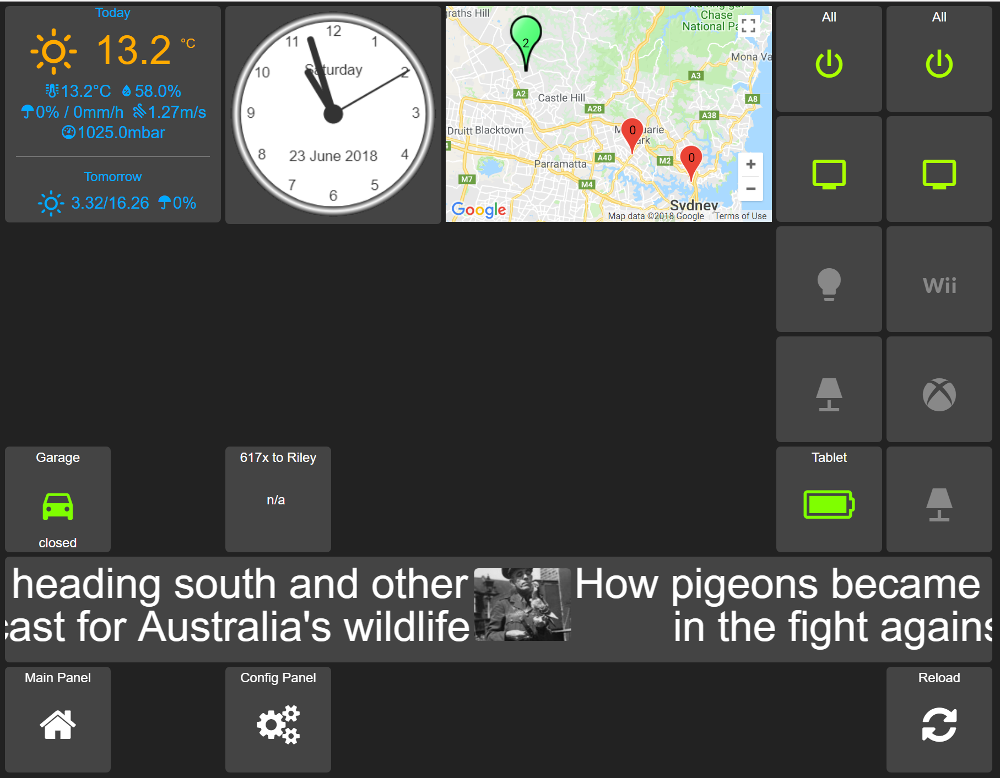

# CustomWidgets
Home Assistant Appdaemon HADashboard custom widgets

I am not sure that I have applied styles correctly or at all to these so if there are issues and you can help with please let me know. 

# Google Map Widget (basegooglemap)
Presents tracked devices and zones in a google map. 

The zone shows the count of devices in the location, devices show first character of the tracked device's friendly name. 

An information window is shown when the pin is clicked, with zones showing the friendly name of each tracked device and the divice pin shows the suburb/street name it is currently located.

- requires Google API key
  - Maps JavaScript API
  - Geocoding API
  
see the .dash extract for settings.

# Analogue Clock Widget (baseanalogclock)
Shows an old fashioned clock face with day and date.
- localise the clock date by modifying these settings in the .dash config
  - date_format_country: "en-AU"
  - date_format_options: {year: 'numeric', month: 'long', day: 'numeric'}

# RSS Marquee Widget (baserssmarquee)
Shows a ticker/marquee style for rss feeds. 

Uses the AppDaemon RSS widget as the basis for this so the setup is pretty much identical. 
- set the feeds up as documented in the AppDaemon HADashboard documentation.
- interval setting defines the speed of the ticker
- recent sets the maximum number of stories to show.

# Evaluated Icon Widget (baseiconeval)
Modifies the icon based on the 'eval' of a rule provided.

This is an extension of the AppDaemon Icon widget that sets the icon based on the state of the monitored entity. This widget allows for the evaluation of a rule for example '< 10' so a numeric rule can be used to modify an icon and it's colour. I use this to show the battery/charging status of the tablets on my network.

# Input Text Widget (baseinputtext)
Allows the input of text using a widget.
The input capability is provided using a modal window displayed in the centre of the screen.
The data input can be evaluated using a regular expression to validate the input and the error message can be set in the .dash confg
